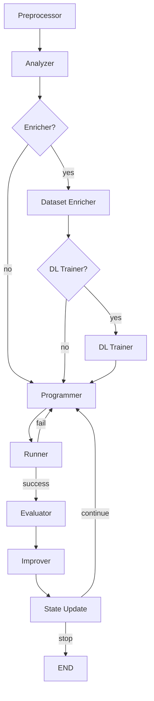

# LangGraph CV Agent System


An agent-based system for iterative Computer Vision solution development using LangGraph orchestration.

---

## ⚙️ Installation

```bash
pip install -r requirements.txt
```

---

## ▶️ Run

```bash
python main.py
```

---

## 🧪 Tests

```bash
python -m pytest tests
```

---

# 🧠 How it works

The system is a pipeline of agents that:

- preprocess data
- analyze data
- optionally enrich dataset and train DL models
- generate solution code
- execute code
- evaluate results
- suggest improvements
- iterate until convergence or limit

---

# 🔄 LangGraph Flow


